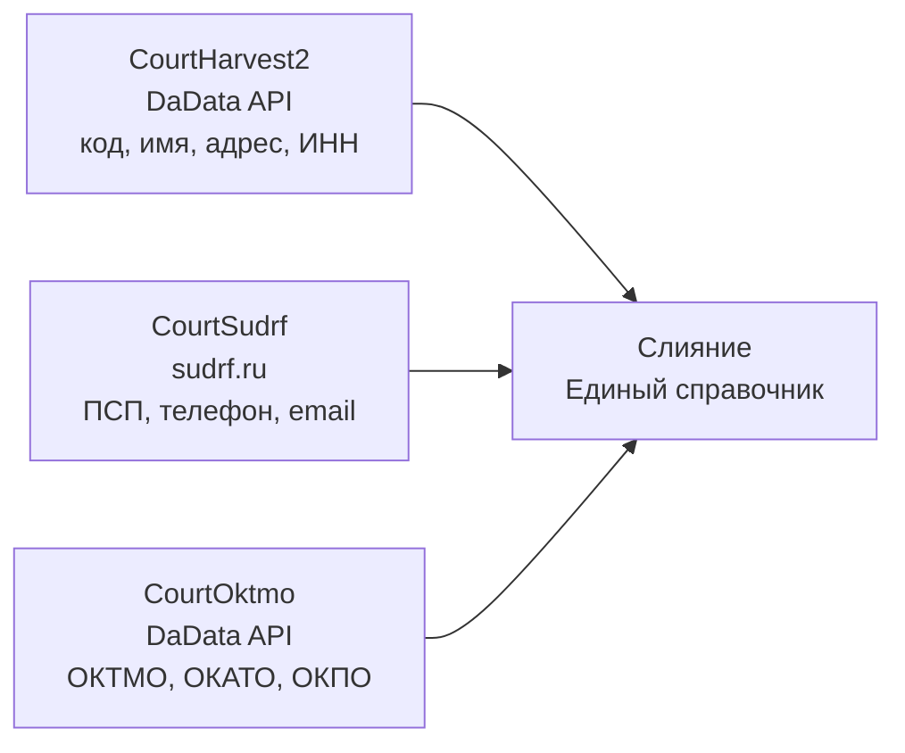

# CONTEXT.md — CourtOktmo

## Назначение

**CourtOktmo** — CLI-инструмент для определения ОКТМО/ОКАТО/ОКПО для адресов судов РФ через DaData API.

Является третьим компонентом экосистемы сбора данных о судах:



## Источники ОКТМО

### 1. ГАР (ФИАС) — основной источник

Официальный реестр Росреестра. XML-файлы выгружаются ежемесячно (~54 ГБ).

| Файл ГАР | Что даёт |
|----------|----------|
| `AS_ADDR_OBJ` | Адресные объекты (регионы, города, улицы) с OBJECTID/OBJECTGUID |
| `AS_HOUSES` | Дома с OBJECTGUID и номерами |
| `AS_MUN_HIERARCHY` | Муниципальная иерархия с **ОКТМО** в PATH |

**Пайплайн:** build-addr-map → build-mun-map → build-houses-map → build-street-houses-map → resolve-court-address

### 2. DaData /suggest/party (по ИНН) — для судов с ИНН

Для 229 судов (AS, OS, AA, AO, AJ, KJ, AV, KV, OV, VS). Возвращает: **okpo, okato, oktmo**.

### 3. DaData /suggest/address — фоллбэк

Для адресов, не найденных в ГАР, и для детекции изменений (при переездах).

### Сравнение методов

| Характеристика | suggest/party | suggest/address |
|---------------|:-------------:|:---------------:|
| ОКТМО | ✅ | ✅ |
| ОКАТО | ✅ | ✅ |
| ОКПО | ✅ | ❌ |
| Нужен ИНН | ✅ | ❌ |
| Нужен адрес | ❌ | ✅ |
| Запросов | 229 | ~10 000 + ~155 ПСП |

## Алгоритм сбора

1. **party** — все суды с ИНН из CourtHarvest2 (229 запросов)
2. **address** — main-адреса всех судов из CourtHarvest2 (10 000 запросов)
3. **address (PSP)** — ПСП-адреса из CourtSudrf (155 запросов)

## Формат данных

Совместим с CourtHarvest2 и CourtSudrf:

```json
{
  "code": "59RS0001",
  "name": "Дзержинский районный суд г. Перми",
  "inn": null,
  "court_type": "RS",
  "address": "614068, Пермский край, г. Пермь, ул. Плеханова, д. 40",
  "okmo": "57701000001",
  "okato": "57401365000",
  "okpo": null
}
```

Поля ОКТМО/ОКАТО/ОКПО добавляются к существующим записям без удаления других полей.

## Структура проекта

```
CourtOktmo/
├── src/
│   ├── index.ts              CLI (commander)
│   ├── env.ts                Загрузка .env
│   ├── core/
│   │   ├── DaDataClient.ts   HTTP-клиент для suggest/party и suggest/address
│   │   ├── KeyManager.ts     Ротация ключей DaData
│   │   └── OktmoResolver.ts  Логика разрешения ОКТМО
│   └── types/
│       └── dadata.ts         Типы DaData API
├── gar/                      Пайплайн ГАР (ФИАС)
│   ├── extract-gar.mjs       Извлечение XML из zip-архива
│   ├── build-addr-map.mjs    Сборка addr-map
│   ├── build-mun-map.mjs     Сборка mun-map (ОКТМО)
│   ├── build-houses-map.mjs  Сборка houses-map
│   ├── build-street-houses-map.mjs
│   ├── resolve-court-address.mjs  Разрешение адресов судов
│   └── run-all-regions.mjs   Массовый прогон всех регионов
├── ref/
│   └── gar_schemas.zip       XSD-схемы ГАР
├── keys/                     API-ключи (.env)
├── data/                     Результаты (prefixes, resolved-*)
├── package.json
├── tsconfig.json
├── README.md
├── CONTEXT.md
└── LICENSE
```

## Технические решения

### Ключи DaData

Переиспользуются ключи из CourtHarvest2. 4 ключа по ~9 500 запросов.

### Rate limiting

minTime = 200ms (5 запросов/с). С 4 ключами — 20 запросов/с.

### ESM

Проект на ESM (`"type": "module"`). Все импорты с расширением `.js`.

### TypeScript 7 + erasableSyntaxOnly

Те же правила, что и в CourtHarvest2:
- Без `constructor(private x: T)` — явное поле + присваивание
- Без декораторов и enum
- strict mode, noUnusedLocals, noUnusedParameters

## Ограничения

1. **DaData suggest/address может не найти адрес** — если адрес указан в нестандартном формате (сокращения, старые названия). Такие адреса пропускаются (около 5%).
2. **Мировые судьи (MS)** — в CourtSudrf нет адресов MS, поэтому для них адреса берутся из CourtHarvest2.
3. **Лицензия DaData** — бесплатный ключ: 10 000 запросов/день на suggest + party + address. При полном сборе (10 000+) требуется 2 ключа или 2 дня.

## Связанные проекты

- [CourtHarvest2](https://github.com/AlexanderKuzikov/CourtHarvest2) — сборщик через DaData API (10 225 судов)
- [CourtSudrf](https://github.com/AlexanderKuzikov/CourtSudrf) — парсер sudrf.ru (ПСП, телефоны, email)
- [Court-Harvester](https://github.com/AlexanderKuzikov/Court-Harvester) — v1, предшественник
- [Court-Viewer](https://github.com/AlexanderKuzikov/Court-Viewer) — UI для базы
